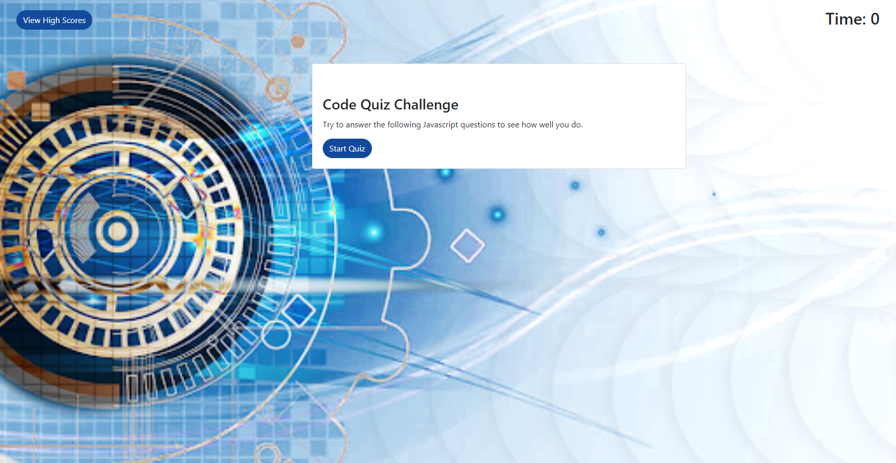
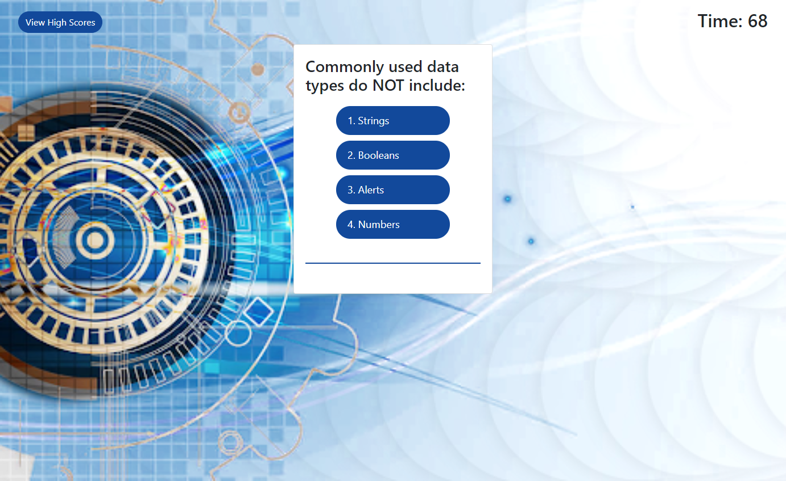

# javascriptCodeQuiz

#### By John Toth

## Description

This project demonstrates utilizing javascript by constructing a quiz program that a user can take and have scored.  This project utilized html, css and javascript in addition to incorporating bootstrap components.  This project also demonstrates usage of browser local storage concepts.

The initial screen allows user to either start the quiz or view the high score list.   Upon starting the quiz, the user is presented a series of questions with 4 multiple choice questions.   The timer in upper right corner of screen will determine the user's ultimate score on the quiz.   For every question the user gets incorrect, 15 seconds are removed from the timer.  As the user selects an answer from those presented, the next question is displayed along with its associated answer set.   User is also informed of whether they answered the previous question correctly or incorrectly.  

When the last quiz question is answered, the quiz completes and user is presented their score.  The user is then asked for their initials (only 2 characters permitted).   When the Submit button is clicked, the high score list is displayed.  The user's current score is presented in the sorted high score list.   The current score is shown in red.   At this point, the user can either go back and take quiz again or choose to clear the high score list.

## Screenshot

The following is a screenshot of the opening quiz application page.

  

The following is a screenshot of the quiz questions and choices.

  

The following is a screenshot of the quiz completion screen where user enters their initials and submits high score.

  

The following is a screenshot of the quiz high score list.

  

## Setup/Installation Requirements

Direct link to repository:  https://github.com/jtoth7824/javascriptCodeQuiz

Direct link to Javascript Quiz webpage:  https://jtoth7824.github.io/javascriptCodeQuiz/

## Support and contact details

Please email me for further questions at jtoth7824@gmail.com

## Technologies Used

Javascript

Local Storage

HTML

CSS

Bootstrap components
